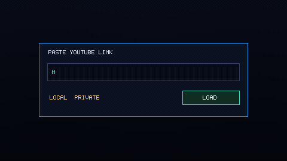

# Capyap



Local-first YouTube transcript assistant with citation-grounded answers.

Capyap gives non-coder users a simple local workflow:
- paste a YouTube link (or transcript file)
- ask questions in the AI panel
- get answers with timestamp evidence
- click timestamps to open YouTube at the exact moment
- use Chapters side panel (native chapters or AI-generated chapters)
- export transcript data in lightweight formats

Privacy rule:
- Your API key is used directly for this session and is never stored on disk. Capyap runs locally on your machine.

## Quickstart (Recommended)

```bash
git clone https://github.com/arashabadi/capyap.git
cd capyap
conda env create -f capyap.yml
conda activate capyap
npm run build
capyap start
```

What happens:
- `npm run build` installs frontend deps only if needed, then builds static assets
- `capyap start` launches local backend + UI and opens your browser automatically

## First Run in the App

1. Paste a YouTube URL or local transcript `.txt` path.
2. Click `Start AI Analysis`.
3. Choose provider and paste your API key for this session.
4. Ask questions and review timestamp citations.

## Daily Usage

```bash
conda activate capyap
capyap start
```

Useful flags:
- `capyap start --no-browser`
- `capyap start --port 8080`
- `capyap start --host 0.0.0.0`

## Desktop Downloads

- Latest installers (macOS, Windows, Linux): [GitHub Releases](https://github.com/arashabadi/capyap/releases/latest)

## Publish Desktop Releases (No Local Build Needed)

Release builds are fully automated in GitHub Actions.

1. Commit and push your changes to `main`.
2. Create a version tag:

```bash
git tag -a v1.0.0 -m "Capyap v1.0.0"
git push origin v1.0.0
```

3. GitHub Actions runs `Desktop Release` and publishes installers to:
   [GitHub Releases](https://github.com/arashabadi/capyap/releases/latest)

The workflow file is:
- `.github/workflows/desktop-release.yml`

Before creating a public release tag, confirm:
- `Desktop Build` workflow passes on `macos-latest`, `ubuntu-22.04`, `windows-latest`
- `Desktop Release` workflow exists and is enabled
- Desktop icons are committed in `apps/desktop/src-tauri/icons/`

## Export Options

- `Clean Text (.txt)`: plain transcript text
- `With Timestamps (.txt)`: transcript with `[mm:ss]` markers
- `Raw JSON (.json)`: structured transcript, metadata, and chapters
- `HTML (.html)`: readable export with chapter sidebar, chapter `View` links, segment `View` buttons, and timestamp anchors

## Project Structure

- `apps/backend/`: FastAPI + LangGraph agent backend
- `apps/frontend/`: React/Vite UI (source loader + transcript + AI panel)
- `apps/desktop/`: Tauri desktop shell (macOS/Windows/Linux)
- `src/youtube_video_summarizer/`: Python package and CLI entrypoints
- `apps/UI_LLM_BRIEF.md`: page-by-page product/UI brief for design LLMs

## Docs

- `docs/README.md`
- `docs/AGENTIC_SYSTEM_ARCHITECTURE.md`
- `docs/DEVELOPMENT_GUIDE.md`
- `docs/SECURITY_AND_PRIVACY.md`
- `docs/RELEASE_CHECKLIST.md`
- `docs/CAPYAP_CLI.md`

## Developer Mode (Optional)

For separate backend/frontend/desktop development flow, see:
- `apps/README.md`

## Capyap CLI Tools (Optional)

Capyap includes script-friendly CLI commands:
- `yt-extract-summarize`
- `yt-transcript-chat`

See `docs/CAPYAP_CLI.md`.

## Troubleshooting

- `capyap: command not found`
  - Ensure env is active: `conda activate capyap`
  - Reinstall package in env: `python -m pip install -e .`

- `Frontend build not found`
  - Run once from repo root: `npm run build`

- Port already in use
  - Use another port: `capyap start --port 8080`

## Contributing

See `CONTRIBUTING.md`.

## License

MIT
